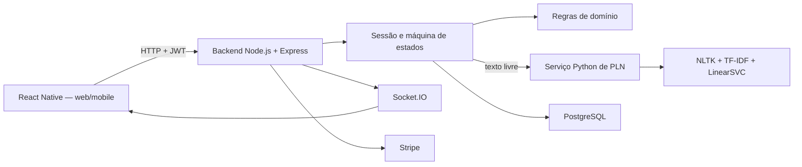
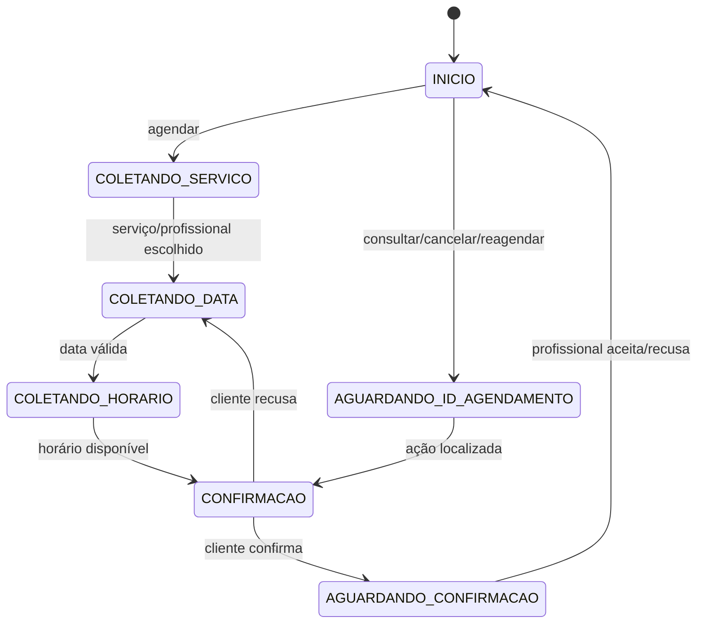

# Chatbot DelBicos — fluxo de uso e funcionamento técnico

## 1. Objetivo

O chatbot auxilia o cliente a agendar, consultar, cancelar e reagendar serviços
no DelBicos. A solução não utiliza IA generativa. A compreensão da mensagem é
feita com Processamento de Linguagem Natural (PLN), combinando:

- regras determinísticas para comandos, datas, horários e dados estruturados;
- NLTK para normalização, tokenização e stemming em português;
- TF-IDF para representar textos numericamente;
- SVM (`LinearSVC`) para classificar a intenção;
- respostas previamente definidas no backend;
- uma máquina de estados para controlar a conversa.

O mesmo frontend React Native atende web e mobile. O código visual do chatbot
já existente foi mantido; a implementação atual altera a forma de compreender
as mensagens e integra o chat aos estados reais do agendamento e pagamento.

## 2. Arquitetura



O frontend nunca chama o Python diretamente. O backend Node.js é o
orquestrador: autentica, carrega a sessão, consulta o classificador, executa as
regras de negócio, acessa o banco e devolve a resposta.

## 3. Fluxo de uso pelo cliente

### 3.1 Abertura do chatbot

O cliente abre o botão flutuante. O frontend consulta:

```http
GET /api/chat/bot/session/active
Authorization: Bearer <token>
```

Se existir uma sessão ativa e recente do mesmo usuário, o frontend restaura:

- mensagens;
- estado atual;
- contexto coletado;
- agendamento acompanhado;
- status do aceite e do pagamento.

Sessões concluídas, reiniciadas ou expiradas não são restauradas como conversa
ativa. Por padrão, a validade é de 24 horas, configurada por
`BOT_SESSION_TTL_HOURS`.

### 3.2 Envio de mensagem

O frontend envia:

```http
POST /api/chat/bot/message
Authorization: Bearer <token>
Content-Type: application/json
```

```json
{
  "message": "quero agendar montagem de móveis sexta de manhã",
  "session_id": 123,
  "channel": "web",
  "timezone": "America/Sao_Paulo",
  "utc_offset_minutes": -180
}
```

O backend devolve um contrato orientado a estado:

```json
{
  "session_id": 123,
  "message": "Encontrei estes profissionais...",
  "state": "COLETANDO_SERVICO",
  "context": {
    "intent": "AGENDAR",
    "serviceName": "Montagem de móveis",
    "serviceOptionsData": []
  },
  "clear_history": false
}
```

O frontend não tenta decidir a regra de negócio. Ele renderiza a resposta, o
estado e o contexto fornecidos pelo backend.

## 4. Compreensão da mensagem

### 4.1 Ordem de decisão

O backend analisa a entrada nesta ordem:

1. comandos globais, como `reiniciar` e `começar de novo`;
2. entradas estruturadas, como `sim`, `não`, números, datas e horas;
3. classificação TF-IDF + SVM das demais mensagens textuais de intenção;
4. validação ou correção por regra explícita de comandos inequívocos, como
   `quero agendar`, `cancelar` e `trocar horário`;
5. extração determinística de entidades;
6. `FALLBACK` quando a confiança é insuficiente.

Essa combinação faz toda mensagem textual de intenção passar pelo PLN e mantém
comandos importantes previsíveis. Se o classificador estiver indisponível, uma
regra explícita ainda pode atuar como contingência para comandos inequívocos.

### 4.2 Serviço Python

O backend chama internamente:

```http
POST http://nlu-service:8000/classify
```

```json
{ "text": "gostaria de contratar alguém para montar um armário" }
```

O serviço retorna:

```json
{
  "intent": "AGENDAR",
  "confidence": 0.91,
  "model_version": "tfidf-word-char-linear-svm-..."
}
```

As intenções atuais são:

- `AGENDAR`;
- `ALTERAR`;
- `CANCELAR`;
- `CONSULTAR`;
- `SAUDACAO`;
- `FALLBACK`.

### 4.3 Treinamento

Antes do treinamento ou da classificação, o texto é convertido para minúsculas;
URLs e menções são removidas integralmente; acentos, emojis, pontuação e espaços
excedentes são normalizados; em seguida, o NLTK tokeniza e aplica stemming em
português. Não são utilizados POS Tagging, NER nem lematização. A extração de
entidades do domínio descrita na seção seguinte é determinística e não constitui
um modelo de NER.

O corpus versionado contém exemplos associados a cada intenção. No build do
contêiner Python:

1. o corpus é carregado;
2. 20% das frases são separadas para avaliação estratificada;
3. são criados TF-IDF de palavras/bigramas e n-gramas de caracteres;
4. o `LinearSVC` é treinado;
5. são calculadas acurácia, F1 macro e relatório por classe;
6. o modelo de produção é treinado novamente com todo o corpus;
7. `joblib` grava `intent_classifier.joblib`;
8. as métricas são gravadas em `metrics.json`;
9. os testes Python são executados durante o build.

Os artefatos são derivados do código e do corpus. Eles não representam uma
conversa treinada manualmente nem dependem do volume do Docker para existir.

### 4.4 Extração de entidades

O SVM classifica a intenção. Dados que dependem de formato e calendário são
extraídos por regras Node.js:

- serviço;
- ID do agendamento;
- data;
- horário;
- período do dia;
- seleção numérica apresentada anteriormente.

Exemplos aceitos:

```text
sexta
sexta que vem
próxima sexta
dia 13
13 de agosto
treze do 09
14:30
14h30
duas da tarde
de manhã
à noite
```

O fuso do dispositivo é enviado pelo frontend. Se estiver ausente ou inválido,
o backend usa `America/Sao_Paulo`.

Quando uma hora em formato de 12 horas não contém período, a lista exibida pode
eliminar a ambiguidade. Por exemplo, `seis horas` passa de `06:00` para `18:00`
somente se `06:00` não estiver disponível e `18:00` estiver entre as opções.
Horários e períodos explícitos não são reinterpretados.

## 5. Máquina de estados



Cada estado implementa três responsabilidades:

1. validar a mensagem com base no contexto atual;
2. executar consultas ou alterações permitidas;
3. devolver texto, próximo estado e atualização de contexto.

O contexto pode conter serviço, profissional, preço, duração, data, hora,
sugestões, `appointmentId`, status e pagamento.

## 6. Agendamento pelo chatbot

Ao confirmar a solicitação, o backend:

1. valida cliente, serviço, profissional, endereço, data e horário;
2. converte a data/hora local para UTC;
3. verifica disponibilidade;
4. cria o agendamento com status `pending`;
5. cria a sala de conversa entre cliente e profissional;
6. cria notificações persistentes;
7. vincula o agendamento à sessão do bot;
8. muda a sessão para `AGUARDANDO_CONFIRMACAO`.

O pagamento ainda não ocorre nesta etapa.

## 7. Aceite do profissional

Na agenda do profissional, o botão **Aceitar** envia:

```http
PUT /api/appointments/:id
Authorization: Bearer <token>

{ "status": "confirmed" }
```

O backend verifica se o usuário autenticado é o profissional responsável e se
o agendamento continua pendente. Depois:

1. grava `confirmed` no PostgreSQL;
2. cria uma notificação para o cliente;
3. atualiza a sessão ativa do chatbot;
4. grava uma mensagem automática no histórico;
5. emite `appointment:status` ao cliente e ao profissional.

Exemplo do evento:

```json
{
  "appointment_id": 90,
  "status": "confirmed",
  "message": "O profissional confirmou seu agendamento...",
  "payment_status": "pending",
  "payment_pending": true,
  "paid": false,
  "updated_at": "2026-08-05T17:00:00.000Z"
}
```

## 8. Atualização em tempo real e contingência

O frontend mantém uma conexão Socket.IO autenticada. A conexão é compartilhada
entre os consumidores para não criar um socket para cada componente.

Quando o evento chega:

- a agenda consulta os agendamentos novamente;
- o cartão do cliente exibe **Pagamento pendente**;
- o chatbot adiciona a mensagem de confirmação;
- o banner do chat habilita **Pagar**.

Se o socket estiver indisponível, o frontend consulta:

```http
GET /api/chat/bot/appointments/:id/status
```

- a cada 5 segundos enquanto aguarda o profissional;
- a cada 10 segundos enquanto aguarda o pagamento;
- para quando não existe mais mudança pendente.

Se o cliente estava offline, a agenda é atualizada ao abrir e a mensagem do bot
é recuperada da sessão ativa.

## 9. Pagamento

Ao clicar em **Pagar** no chatbot:

1. o painel é fechado/minimizado;
2. data e hora do contexto são combinadas;
3. o frontend converte o horário local para ISO UTC;
4. navega para o checkout com o `appointmentId` existente;
5. o usuário seleciona o endereço e conclui o Stripe.

Após o Stripe informar `succeeded`, o backend:

1. valida o `PaymentIntent`;
2. localiza o agendamento existente;
3. grava `payment_intent_id`;
4. cria a notificação de pagamento;
5. sincroniza novamente chatbot e agenda;
6. emite `appointment:status` com `paid: true`.

Regra de apresentação:

```text
confirmed + payment_intent_id ausente  = pagamento pendente
confirmed + payment_intent_id presente = confirmado e pago
```

Uma falha somente no push em tempo real não reverte o pagamento. O estado
persistido continua disponível pelo polling.

## 10. Reinício e histórico

Ao selecionar **Reiniciar**, o frontend envia a mensagem especial `reiniciar`.
O backend encerra a sessão ativa, cria outra vazia e retorna:

```json
{ "clear_history": true }
```

O frontend remove mensagens, contexto e vínculo local. O agendamento real não é
apagado: continua na agenda e nas notificações, mas não reativa nem repovoa a
conversa que o usuário escolheu limpar.

## 11. Responsabilidades do frontend

- abrir/fechar o widget no layout web e mobile;
- coletar e enviar mensagens;
- enviar JWT, canal e fuso;
- guardar estado transitório no Zustand;
- restaurar o histórico pela API;
- renderizar bolhas, cartões, opções e horários;
- ouvir Socket.IO;
- fazer polling como contingência;
- navegar ao checkout e fechar o chat;
- nunca decidir diretamente se um agendamento pode ser criado ou alterado.

## 12. Responsabilidades do backend Node.js

- autenticar e autorizar;
- controlar sessão e máquina de estados;
- priorizar regras e chamar o classificador Python;
- extrair entidades determinísticas;
- consultar serviços, profissionais e disponibilidade;
- criar/cancelar/reagendar agendamentos;
- persistir sessão e mensagens;
- emitir eventos e notificações;
- integrar pagamento;
- fornecer polling seguro por cliente.

## 13. Responsabilidades do serviço Python

- carregar corpus e treinar o modelo;
- normalizar e tokenizar português;
- transformar texto com TF-IDF;
- classificar com SVM;
- calcular confiança pela margem da decisão;
- aplicar o limiar de `FALLBACK`;
- expor `/health` e `/classify`.

Ele não acessa JWT, banco, Stripe, agenda ou Socket.IO e não gera respostas.

## 14. Persistência

| Dado | Persistência |
| --- | --- |
| Sessão, estado e contexto do bot | PostgreSQL — `bot_chat_session` |
| Mensagens do bot e usuário | PostgreSQL — `bot_chat_message` |
| Agendamento e pagamento | PostgreSQL — `appointment` |
| Conversa humana cliente/profissional | MongoDB/estrutura de chat existente |
| `session_id` local | AsyncStorage por meio do Zustand |
| Modelo TF-IDF/SVM | Artefato `joblib` dentro da imagem Python |

## 15. Segurança e isolamento

- endpoints do chatbot exigem JWT;
- o rate limit é de 30 mensagens por minuto por usuário;
- uma sessão só pode ser restaurada pelo seu proprietário;
- o status só é consultado pelo cliente do agendamento;
- somente o profissional responsável aceita ou recusa;
- o Socket.IO valida JWT no handshake e utiliza salas `user:<id>`;
- entradas têm tamanho e caracteres controlados;
- o classificador possui timeout e falha para `FALLBACK` sem chamar IA externa.

## 16. Execução local

O `docker-compose.yml` executa:

- `postgres`;
- `mongo`;
- `nlu-service`;
- `delbicos-server`.

Variáveis principais:

```env
NLU_SERVICE_URL=http://nlu-service:8000
NLU_CLASSIFIER_TIMEOUT_MS=1000
NLU_CONFIDENCE_THRESHOLD=0.65
BOT_SESSION_TTL_HOURS=24
```

O serviço Python possui healthcheck. O backend só deve começar a usar o
classificador depois que o modelo estiver carregado.

### 16.1. Disponibilidades para testes locais

Os dados locais possuem duas camadas de disponibilidade:

- `professional_availability`: agenda geral do profissional;
- `service_availability`: dias e horários específicos de cada serviço.

O seeder `012-initial-availabilities.js` cobre os sete profissionais iniciais.
O seeder `20260527200000-initial-service-availabilities.js` cobre os respectivos
serviços sem assumir que eles sejam os primeiros IDs do banco. Já o seeder
`20260812200000-demo-professional-availabilities.js` complementa os oito
profissionais demonstrativos e todos os seus serviços ativos com agendas de
segunda a sábado.

Profissionais e serviços são localizados por chaves estáveis, principalmente
e-mail do profissional + título do serviço. Os seeders de serviços `007` e
`010` também verificam registros existentes antes da inserção, evitando
duplicatas quando forem executados novamente.

Os seeders inserem apenas regras ainda inexistentes. Assim, podem ser executados
isoladamente em um banco local já populado:

```bash
npx sequelize-cli db:seed --seed 007-initial-reformas-services.js
npx sequelize-cli db:seed --seed 010-demo-professional-services.js
npx sequelize-cli db:seed --seed 012-initial-availabilities.js
npx sequelize-cli db:seed --seed 20260527200000-initial-service-availabilities.js
npx sequelize-cli db:seed \
  --seed 20260812200000-demo-professional-availabilities.js
```

Em uma instalação nova, `npm run seed` executa a sequência completa. As
disponibilidades específicas respeitam o intervalo de trabalho definido para
cada profissional. O chatbot ainda desconta agendamentos `pending` ou
`confirmed` antes de apresentar os horários ao cliente.

## 17. Testes

- testes Python verificam normalização e classificação;
- testes Node verificam NLU, regras de status, datas e horários;
- lint TypeScript valida o backend;
- lint direcionado valida os componentes alterados no frontend;
- o fluxo manual deve ser testado com uma sessão de cliente e outra de
  profissional.

## 18. Documentos relacionados

- `docs/DOCUMENTACAO_TECNICA_PLN_CHATBOT.md`: seção acadêmica 9, com
  funcionalidades, tecnologias, dataset, treinamento e métricas;
- `docs/CHATBOT_PLN.md`: decisão técnica e regras de PLN;
- `docs/CHATBOT_INVENTARIO_BACKEND.md`: arquivos do backend;
- `DelBicosV2/docs/CHATBOT_INVENTARIO_FRONTEND.md`: arquivos do frontend.
